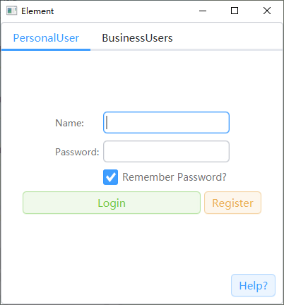

# ElementFX

ElementUi in javafx,that you can get a beautiful applications with only one line code.  
JavaFX版本的ElementUi，您可以仅需一行代码而轻松美化您的JavaFX应用

### Usage:

For Java:
```
        Scene scene = new Scene(root);
        scene.getStylesheets().add(CssResources.globalCssFile);
        scene.getStylesheets().add(CssResources.buttonCssFile);//可选，用于每个组件可单独调整主题
        /*
        or：
        CssResourcesKt.themes(scene, (strings, cssResources) -> {
            strings.add(CssResources.globalCssFile);
            strings.add(CssResources.buttonCssFile);
            return null;
        });
        */
        primaryStage.setScene(scene);
        primaryStage.setTitle("ElementForJavaFX");
        primaryStage.show();
```
For Kotlin:
```
    primaryStage.run {
        scene = Scene(root,400.0,400.0).apply {
            themes {
                this += it.globalCssFile
                this += it.buttonCssFile//可选，用于每个组件可单独调整主题
            }
        }
        title = "ElementForJavaFX"
        show()
    }
```

### Note:

本项目尚未在仓库中发布，您可以自行在out/production/resources/cloud_css中找到您需要的css文件通过JavaFx的api自行引入
也可以在release中下载预览版本通过本地导入的方式引用
具体用法请查看demo

This project has not yet been released in the maven,but you can find the css file you need in out/production/resources/cloud_css and import it by JavaFx api.  
You can also download the preview version in the release and importing in locally way.  
Please refer to the demo for details.


## 当前支持的组件(Supported nodes):
> + Button
> + TextField
> + ListView
> + TextArea
> + Label
> + ComboBox
> + CheckBox
> + ScrollPane
> + ScrollBar
> + DatePicker
> + TableView
> + Spinner
> + TabPane
> + Pagination
> + ContextMenu
> + Slider
> + ProgressBar
> + TreeView

#### 示例效果：
  
Demo path is : src/test/kotlin/testapp/Demo.kt


### todo:
为每个组件单独调整主题:
例如：
```
        val regButton = Button("Register").apply {
            theme(ElementButton.orangeButton)
        }
```
<font color="red" size="4px">NOTE:当前仅支持TextField和Button</font>