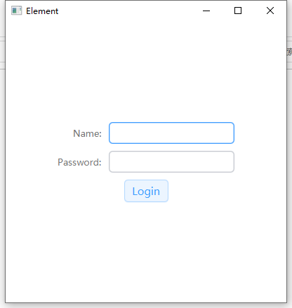

# ElementFX

ElementUi in javafx,that you can get a beautiful applications with only one line code.

JavaFX版本的ElementUi，您可以仅需一行代码而轻松美化您的JavaFX应用

Using:

For Java:
```
        Scene scene = new Scene(root);
        scene.getStylesheets().add("ElementFX_Snapshot.css");
        primaryStage.setScene(scene);
        primaryStage.setTitle("ElementForJavaFX");
        primaryStage.show();
```
For Kotlin:

```
    primaryStage.run {
        scene = Scene(root).apply {
            stylesheets += "ElementFX_Snapshot.css"
        }
        title = "ElementForJavaFX"
        show()
    }
```

当前支持的组件:

Supported nodes:
> + Button
> + TextField
> + ListView
> + TextArea
> + Label
> + ComboBox
> + CheckBox
> + ScrollPane
> + ScrollBar
> + DatePicker
> + TableView
> + Spinner
> + TabPane
> + Pagination
> + ContextMenu
> + Slider
> + ProgressBar
> + TreeView


#### 示例效果：

